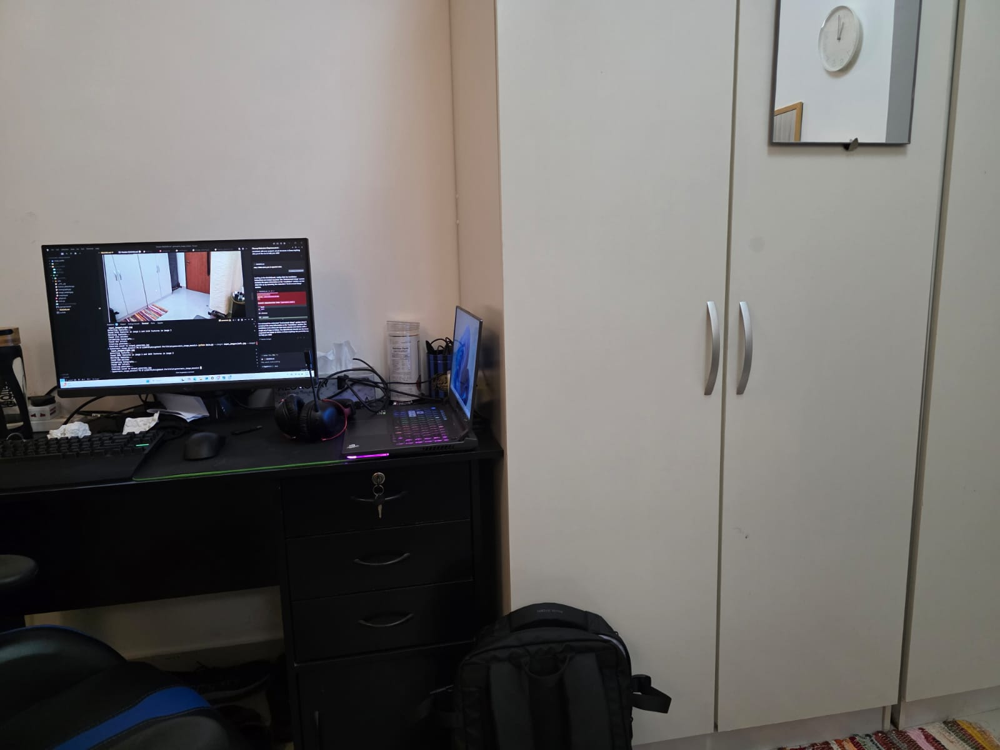

# Panoramic Image Mosaic

This project creates panoramic image mosaics by stitching two images together using homography estimation and RANSAC.

## Features

- Automatic feature detection using SIFT
- Feature matching between images
- Homography estimation using RANSAC
- Image warping and blending for seamless panorama creation

## Requirements

- Python 3.11+
- OpenCV
- NumPy
- SciPy

## Installation

1. Clone this repository:
```bash
# Replace <repository-url> with your repo URL
git clone <repository-url>
cd panoramic_image_mosaic
```

2. Install [uv](https://github.com/astral-sh/uv) package manager (if not already installed):
```bash
pip install uv
```

3. Create and activate a virtual environment:
```bash
# Create virtual environment with Python 3.11
uv venv --python 3.11.12

# Activate the virtual environment
# On Windows:
.\.venv\Scripts\activate
# On Linux/Mac:
source .venv/bin/activate
```

4. Install dependencies from `pyproject.toml`:
```bash
uv sync
```

## Usage

Run the main script with two input images:

```bash
python main.py --image1 path/to/first/image.jpg --image2 path/to/second/image.jpg
```

The output panorama will be saved as `output_panorama.jpg` in the current directory.

## Project Structure

```
panoramic_image_mosaic/
├── README.md
├── pyproject.toml
├── main.py
├── src/
│   ├── feature_detection.py
│   ├── homography.py
│   ├── warping.py
│   └── utils/
│       └── image_utils.py
```

## How It Works

1. **Feature Detection:** SIFT identifies key points in both images
2. **Feature Matching:** Matches corresponding points between images
3. **Homography Estimation:** Uses RANSAC to find the best homography matrix
4. **Image Warping:** Warps one image to align with the other
5. **Image Blending:** Blends the warped image with the reference image to create a seamless panorama

## Example: Desk Setup

Below are example images showing the project in use on a dual-monitor desk setup:

### Coding and Running the Project



### Dual Monitor Setup


### Combined View


---

## License

MIT License
